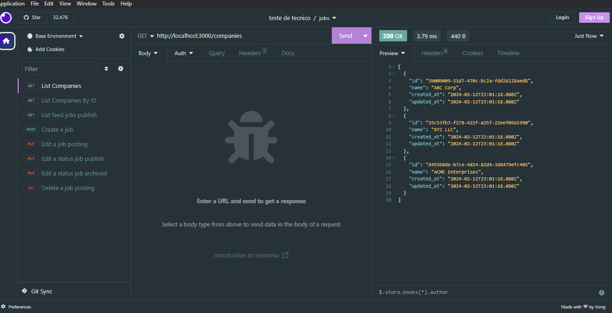

# Avaliação técnica do desenvolvedor back-end

Participar do teste técnico da Plooral foi uma experiência emocionante, desafiadora e inspiradora. A construção da API usando Node.js, Postgres, Express e a conexão em usar AWS service evidenciaram a cultura inovadora da empresa, que está em sintonia com meus objetivos profissionais. A oportunidade de aplicar meus conhecimento reforçou meu entusiasmo em contribuir para projetos significativos junto a essa equipe incrivel. Estou animada com a possibilidade de integrar a equipe, crescer profissionalmente e colaborar para soluções impactantes.
Abaixo irei descrever para como foi a construção e as maneiras de uso da aplicação.
Agradeço pela chance e aguardo ansiosamente o retorno com a oportunidade de fazer parte dessa equipe dedicada.

## Descrição do Teste

A aplicação consiste em gerenciamento de anúncios de emprego, criando endpoints funcionais e coerentes.

## Tecnologias utilizadas:

-   Javascript
-   Node.js (versão: 20.6.1) [Documentação oficial Node.js](https://nodejs.org/docs/latest/api/)
-   Postgres (Versão: 16)

## Bibliotecas:

-   Express (versão: 4.18.2) -> [Documentação](https://expressjs.com/)
-   Pg (versão: 8.11.3) -> [Documentação](https://node-postgres.com/)
-   Knex(versão: 3.1.0) -> [Documentação](https://knexjs.org/)
-   Cors (versão: 2.8.5) -> [Documentação](https://www.npmjs.com/package/cors)
-   Dotenv (versão: 16.4.2) -> [Documentação](https://www.npmjs.com/package/dotenv#%EF%B8%8F-usage)
-   Joi (versão: 17.12.1) -> [Documentação](https://joi.dev/)
-   Aws- sdk (versão: 2.1560.0) -> [Documentação](https://aws.amazon.com/pt/sdk-for-javascript/)

### Dependencias de desenvolvimento:

-   nodemon (versão: 3.0.3) -> [Documentação](https://www.npmjs.com/package/nodemon)
-   prettier (versão: 3.2.5) -> [Documentação](https://prettier.io/docs/en/)

### Ferramentas utilizadas:

-   Insomnia -> [Documentação](https://docs.insomnia.rest/insomnia/get-started)
-   Visual Studio Code
-   Beekeeper Studio

## Como usar:

### [Link do Repositório](https://github.com/StefanyBorin/backend-developer-test/tree/stefany_celeste_borin)

#### 1° Faça um fork do repositório e clone em sua máquina, abra o terminal em uma pasta e digite um dos comandos a seguir de acordo com a chave configurada do seu GIT:

#### Chave ssh:

```bash
git clone git@github.com:StefanyBorin/backend-developer-test.git
```

#### Chave HTTPS:

```bash
 git clone https://github.com/StefanyBorin/backend-developer-test.git
```

#### 2° Abra no VScode e no terminal digite o seguinte comando:

```
npm install
```

3° No terminal use o comando a seguir para usar a sua máquina como servidor e subir a aplicação.

```
npm run dev
```

Logo após executar esses comandos sua aplicação estará rodando no no seu servidor local.

## ENDPOINTS

### 1 - Buscar todas as empresas cadastradas.

Método HTTP - <span style="color:orange;">GET</span>

URL - http://localhost:3000/companies

Resposta:

```json
status code: 200
[
    {
        "id": "3b00b009-51d7-470c-bc2a-fdd26128aed8",
        "name": "ABC Corp",
        "created_at": "2024-02-12T23:01:18.080Z",
        "updated_at": "2024-02-12T23:01:18.080Z"
    },
    {
        "id": "35c53fb7-f278-422f-a25f-22eef0565990",
        "name": "XYZ LLC",
        "created_at": "2024-02-12T23:01:18.080Z",
        "updated_at": "2024-02-12T23:01:18.080Z"
    },
    {
        "id": "d455b8de-b7ce-4d24-82d4-3d8479efc405",
        "name": "ACME Enterprises",
        "created_at": "2024-02-12T23:01:18.080Z",
        "updated_at": "2024-02-12T23:01:18.080Z"
    }
]
```

<BR><BR>

### 2 - Busque uma empresa específica por ID.

Método HTTP - <span style="color:orange;">GET</span>

URL - http://localhost:3000/companies/:company_id

Resposta:

```json
status code: 200
{
	"id": "35c53fb7-f278-422f-a25f-22eef0565990",
	"name": "XYZ LLC",
	"created_at": "2024-02-12T23:01:18.080Z",
	"updated_at": "2024-02-12T23:01:18.080Z"
}
```

<BR><BR>

### 3 - Crie um rascunho de anúncio de emprego.

Método HTTP - <span style="color:orange;">POST</span>

URL - http://localhost:3000/job

Resposta:

```json

status code: 201
{
	"id": "49e54b64-df96-447a-afad-7027d025bcd9",
	"company_id": "d455b8de-b7ce-4d24-82d4-3d8479efc405",
	"title": "Desenvolvedor Backend 24",
	"description": "mkm",
	"location": "São Paulo",
	"notes": "",
	"status": "draft",
	"created_at": "2024-02-22T20:00:27.158Z",
	"updated_at": "2024-02-22T20:00:27.158Z"
}
```

<BR><BR>

### 4 - Editar status da publicação para Published (publique um rascunho de anúncio de emprego.)

Método HTTP - <span style="color:orange;">PUT</span>

URL - http://localhost:3000/job/job_id/publish

Resposta:

```json

status code: 201
{
	"message": "successfully published"
}
```

<BR>
<BR>

### 5 - Arquivar um anúncio de emprego ativo.

Método HTTP - <span style="color:orange;">PUT</span>

URL - http://localhost:3000/job/job_id/archive

Resposta:

```json

status code: 201
{
	"message": "successfully archived"
}
```

<BR>
<BR>

### 6 - Edite um rascunho de anúncio de emprego (título, local, descrição).

Método HTTP - <span style="color:orange;">PUT</span>

URL - http://localhost:3000/job/:job_id

Resposta:

```json

status code: 201
{
	"message": "Data updated successfully"
}
```

<br> <br>

### 7 - Exclua um rascunho de anúncio de emprego.

Método HTTP - <span style="color:orange;">DELETE</span>

URL - http://localhost:3000/job/:job_id

Resposta:

```json

status code: 201
{
	"message": "Successfully deleted post"
}
```

### 8 - Feed de anúncios de empregos com status 'published'

Método HTTP - <span style="color:orange;">GET</span>

URL - http://localhost:3000/feed

Resposta:

```json

status code: 200
[
    {
	"id": "59403d1e-3cad-409e-8b04-69e01a721545",
	"title": "Desenvolvedor Backend",
	"company_name": "XYZ LLC",
	"description": "Trabalhar com node.js",
	"created_at": "2024-02-12 20:39:37.033951-03"
    },
    {
	"id": "59403d1e-3cad-409e-8b04-69e01a721546",
	"title": "Desenvolvedor Backend 2",
	"company_name": "ABC Corp",
	"description": "Trabalhar com node.js",
	"created_at": "2024-02-12 20:39:37.033951-03"
    }
]
```

## Variáveis de Ambiente

Importante: Para rotar a aplicação precisa configurar as variaveis de ambiente com os dados do seu banco de dados e a sua conexão S3 AWS.

No arquivo `.env.exemple` tem o modelo das variaveis que precisa ser adicionada no arquivo `.env`. Copie o modelo `.env.exemple` e cole no `.env` subistituindo pelas informações correspondentes.

## Utilizando no Insomnia


